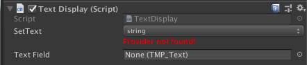
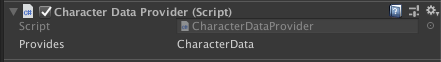
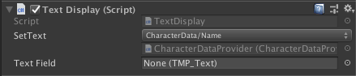

# Hiku

Hiku utilizes Unity's object hierarchy to simplify the way data flows between Unity components.

Hiku has two core component types: providers and receivers. Receiver components expect a certain type of data and look for the closest parent object with a matching provider component. Provider components just provide certain types of data to their child objects.

For example, if you have a provider of player data, as children it could have objects that receive and display the player's name, avatar, and high score. For reusability, the aim should be to keep the receiver components as small as possible, for example:
- Component that takes a string and assigns it into a text field
- Component that takes a date time to display a countdown timer
- Component that takes an identifier and maps that into an image or a prefab
- Component that takes a range of numbers to display a counting animation

Receiver components inherit from ReceiverComponent and receive data through methods tagged with [Receive] -attribute.

Here is a simple component that expects a string and assigns it into a text field.

```c#
public class TextDisplay : ReceiverComponent
{
    [SerializeField] TMP_Text textField = null;

    [Receive] void SetText(string text)
    {
        textField.text = text;
    }
}
```


The component above will, by default, receive its data from the closest parent game object that provides the data of type string.

Provider components inherit from ProviderComponent and provide data through DataFields. Here is an example:

```c#
public class CharacterDataProvider : ProviderComponent
{
    DataField<CharacterData> characterData;

    protected override void Create()
    {
        characterData.Set(new CharacterData());
    }
}
```


In this case, however, the component is not providing data of type string, but CharacterData instead. Here is the class:

```c#
[Receivable]
public class CharacterData
{
    public string Name { get; private set; }
}
```

Since CharacterData has a field of type string, it means we can hook it up with the TextDisplay-component in the editor.



If we wanted to have the TextDisplay also change its data every time a character's name changes, we could do so by defining the Name-field as DataField in CharacterData:

```c#
[Receivable]
public class CharacterData
{
    public DataField<string> Name { get; private set; }
}
```

Receivable-attribute is there to tell the editor scripts to list all the public fields of the class as receivable data.

There is also ProviderReceiverComponent when you need a component to be both receiver and provider.

## Unity Events

Receiver and provider components inherit from MonoBehaviour and introduce some methods to hook on common Unity events: Create, Enable, Disable. Use these methods instead of Unity's OnEnable, OnDisable or Awake, as these are already implemented in the base class.

```c#
protected override void Create()
{
    // Called once when the component has been created.
    // Receivers: Guarantees that all available data has been received.
    // Providers: Called before providing any data to the receivers.
}

protected override void Enable()
{
    // Executes once after Create and every time the component is enabled.
}

protected override void Disable()
{
    // Executes every time the component is disabled.

    // Component will not receive any data updates while it is disabled, 
    // Any data that changes while the component is disabled, 
    // will be received the moment the component is enabled again.
}
```

## Notes

- Receivers components can inherit their data from provider components that are attached to the same game object, however, the provider component needs to be above the receiver component in the object's components list. This restriction is just a simple way to prevent inheritance loops.

- Reflection is used when constructing the receiver and provider components. Receivable fields that are not DataFields will result in dynamic invocation when data changes. If only DataFields are used, then all the types are known during compile-time and no reflection is needed in the process.

- If you need to ensure that data is received in a certain order when a component is created, you can use [Receive(Order=1)]. Lower order receivers will receive their data first.

- Changes to the object hierarchy do not affect the receiver's data source after the receiver has been created. This holds even if the receiver is no longer a child of the provider. This behavior may change in the future.